<h1 align="center">고처리량 상품 이미지 수집 파이프라인</h1>

<p align="center"><b>광명융합기술교육원 5조</b> · 데이터 파이프라인 팀 미션</p>

<p align="center">
  
  
  
  
  
  
</p>

> 단일 EC2 **t3.micro** 한 대에서 상품 상세 페이지를 순회하며 대표 이미지를 **최대 처리율로** 수집하는 생산자–소비자 파이프라인입니다.
> 동시성은 **멀티프로세스 × asyncio 코루틴**(스레드 0)으로 내고, 생산자와 소비자는 **Redis 메시지 큐**로만 통신합니다.
> 3인 팀 속도전 미션에서 **채택된 구현**(가장 빠른 버전)을 정리한 저장소입니다.

> **참고** — 수집 대상은 과제에서 지정됐고, 공개 저장소에서는 특정 사이트에 묶이지 않도록 대상 정보를 환경변수(`TARGET_HOST`)로 분리했습니다.

<details open>
<summary><b>목차</b></summary>
<br>

* [1. 미션 개요](#1-미션-개요)
* [2. 팀 — 5조](#2-팀--5조)
* [3. 아키텍처](#3-아키텍처)
* [4. 실행 환경 — t3.micro의 물리적 한계](#4-실행-환경--t3micro의-물리적-한계)
* [5. 엔지니어링: 병목은 CPU였다](#5-엔지니어링-병목은-cpu였다)
* [6. 최적화: CPU 포화와 RAM 절벽](#6-최적화-cpu-포화와-ram-절벽)
* [7. 확장성 · 유지보수](#7-확장성--유지보수)
* [8. 실행](#8-실행)
* [9. 디렉터리 구조](#9-디렉터리-구조)

</details>

---

## 1. 미션 개요

시작 상품코드에서 **+1씩 순차 증가**하며 유효한 상품 N개(기본 200)의 대표 이미지를 다운로드합니다. 대상 사이트는 존재하지 않는 코드에도 HTTP 200(빈 껍데기)을 돌려주기 때문에, **"유효 = 응답 본문에 이미지 필드가 존재함"**으로 판정합니다. 큐에 적재된 N개 이상의 상품 이미지를 모두 받으면 시스템이 정상 종료합니다.

필수 조건은 둘이었습니다 — **① 생산자–소비자 분리(Redis로만 통신)**, **② Redis 메시지 큐**. 이 위에서 *제한된 t3.micro 한 대로 얼마나 빠르게* 받느냐가 평가 기준이었습니다.

## 2. 팀 — 5조

3인이 각자 파이프라인을 구현해 같은 조건에서 속도를 겨뤘고, **가장 빠른 구현을 팀 제출본으로 채택**했습니다. 이 저장소는 그 채택된 구현입니다.

| 멤버 | 역할 | 비고 |
| :---: | :--- | :--- |
| <a href="https://github.com/SanghyeokLee-KR"></a><br>**[이상혁](https://github.com/SanghyeokLee-KR)**<br>*(조장)* | 파이프라인 설계·구현 | **채택된 구현 (본 저장소)** — async 코루틴 + Redis 큐, 병목 분석·벤치마크 |
| <a href="https://github.com/nohhyunju0212"></a><br>**[노현주](https://github.com/nohhyunju0212)** | 5조 팀원 | 속도전 공동 진행 |
| <a href="https://github.com/adieud99"></a><br>**[김연동](https://github.com/adieud99)** | 5조 팀원 | 속도전 공동 진행 |

## 3. 아키텍처

단일 흐름 스크립트로는 한계가 있어, **확장 가능한 파이프라인**으로 설계했습니다.

<p align="center">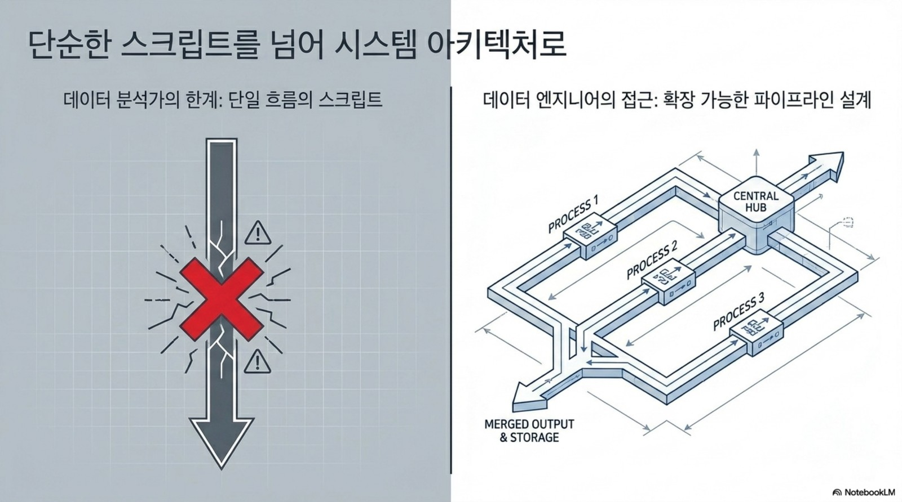</p>

생산자와 소비자를 **완전히 분리**해 비동기적으로 독립 작동시키고,

<p align="center">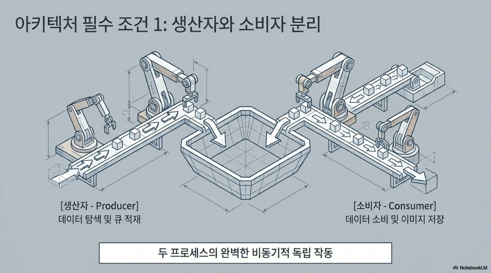</p>

둘 사이는 **Redis 큐**로만 통신합니다. 생산자는 상품 코드를 큐에 적재하고, 소비자는 준비되는 대로 꺼내(Pop) 처리합니다.

<p align="center">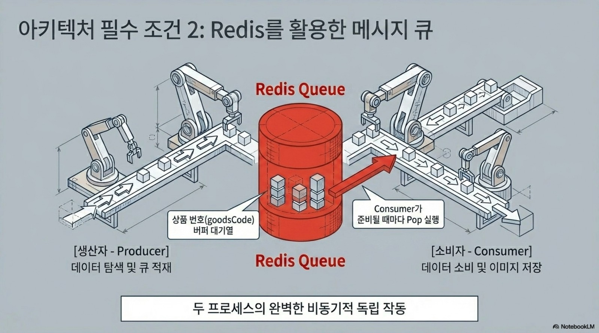</p>

```
[Producer 1프로세스] ──(상품코드 +1)──▶ [Redis 큐] ──▶ [Consumer P프로세스 × C코루틴] ──▶ 디스크
```

- 동시성 = **프로세스 수 × 코루틴 수**(채택값 2 × 128 = 256). 스레드는 한 개도 쓰지 않습니다.
- Redis `INCR`로 슬롯을 원자적으로 예약해 **정확히 N개**만 저장.
- 종료는 카운터가 아니라 **실제 디스크에 쌓인 파일 수**로 판정(§5의 199/200 경합 방지).

### 동시성 규칙 · HTTP 선택

- **미션 규칙: 멀티스레드 금지.** 동시성은 멀티프로세스로 내되, **코루틴(asyncio)은 허용**됐습니다 (`threading.Thread` 0개).
- **채택: 멀티프로세스 × asyncio 코루틴.** 2 vCPU에 맞춰 소비자 프로세스 2개를 띄우고, 각 프로세스가 자체 이벤트 루프에서 코루틴 128개를 돌립니다(총 256 동시). 코루틴 없는 멀티프로세스 전용 버전(`main_mp.py`)도 만들어 비교했습니다(§6).
- **HTTP는 HTTP/2 채택.** 코루틴 수백 개의 요청을 **소수의 keep-alive 커넥션에 멀티플렉싱**해 TLS 핸드셰이크 비용을 크게 줄입니다 — t3.micro 실측에서 HTTP/2가 더 빨랐습니다. (반대로 `main_mp.py`는 프로세스당 1요청이라 멀티플렉싱 이득이 없고 HTTP/2 + 고프로세스는 프레이밍 버퍼로 OOM이 나서, HTTP/1.1을 씁니다.)

## 4. 실행 환경 — t3.micro의 물리적 한계

모든 파이프라인은 **엄격히 제한된 인프라**(vCPU 2 · RAM 1GB) 위에서 돌아야 했습니다. 브라우저 없이 순수 HTTP만 쓰기 때문에, 병목은 RAM이 아니라 **CPU(TLS 핸드셰이크)·네트워크**로 옮겨갑니다.

<p align="center"></p>

> **핵심 원칙 — RAM은 절대선, CPU는 최대로.** RAM이 한 번 터져 **swap으로 넘어가면 처리율이 폭락(11초+)하고 재현성이 0**이 됩니다. 그래서 목표는 *RAM이 swap으로 넘어가지 않는 한계 안에서 2 vCPU(CPU)를 최대로 굴리는* 것입니다.

## 5. 엔지니어링: 병목은 CPU였다

처리율을 올리려면 병목이 **Network I/O인지 CPU인지** 먼저 가려야 했습니다.

<p align="center">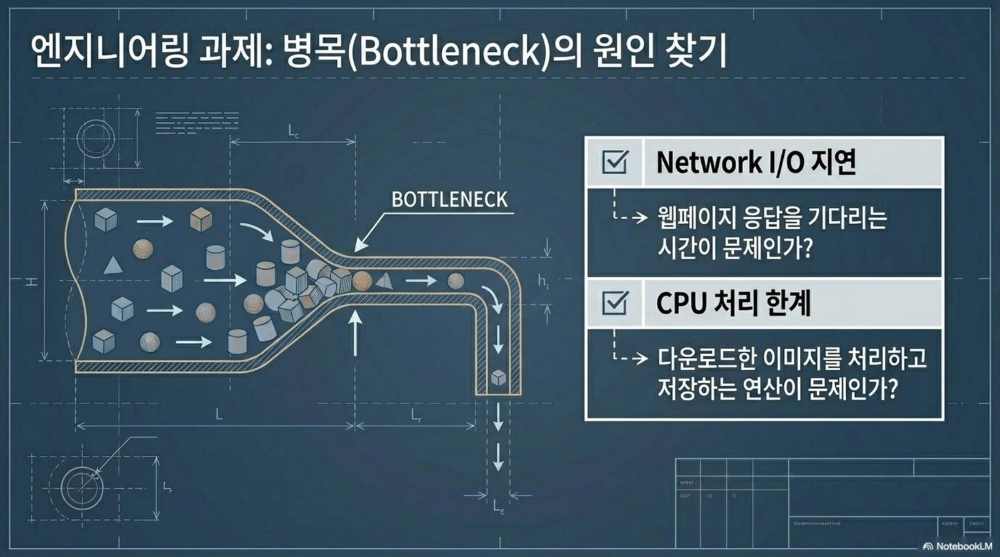</p>

단일 요청 지연과 처리율 천장을 직접 측정했습니다:

<p align="center">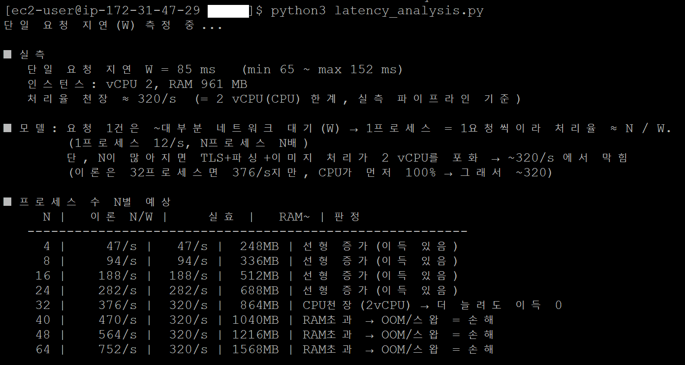</p>

- **단일 요청 지연 W ≈ 85ms**(65~152ms). 한 프로세스(코루틴 1개)는 ≈ 12 page/s.
- 동시성을 올리면 처리율 ≈ N/W로 **선형 증가**하다가, **2 vCPU가 TLS·파싱·이미지 처리로 포화되는 ~320 page/s에서 막힙니다.**
- **천장은 IP 차단이 아니라 CPU였습니다** — 실제 실행에서 **429·차단 = 0**. (이론상 32프로세스면 376/s지만 CPU가 먼저 100%에 닿아 ~320/s)
- 소요 시간 ≈ (N ÷ 유효율) ÷ 320. 유효율(시작 시드가 얼마나 조밀한가)이 시간을 좌우합니다.

## 6. 최적화: CPU 포화와 RAM 절벽

천장이 CPU라면, 최적값은 **CPU를 최대로 쓰되 RAM은 swap 절벽에 닿지 않는** 지점입니다. async와 멀티프로세스를 같은 시드(`5026468`, 200장)로 비교했습니다.

<p align="center">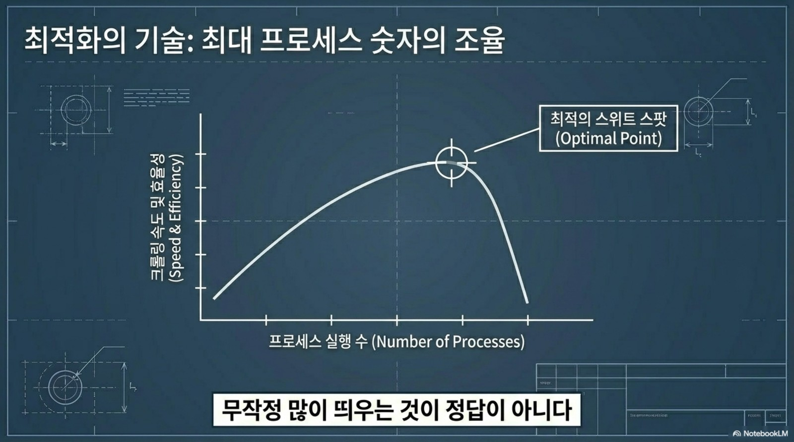</p>

<p align="center">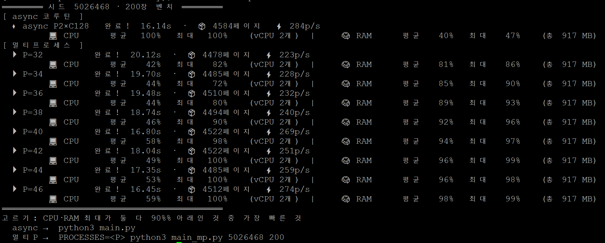</p>

| 구현 | 소요 | 처리율 | CPU(최대) | RAM(최대) |
| :--- | :---: | :---: | :---: | :---: |
| **async 2P × 128코루틴 (HTTP/2)** | **16.14s** | **284 p/s** | 100% | **47%** |
| 멀티프로세스 P32 | 20.12s | 223 p/s | 82% | 86% |
| 멀티프로세스 P40 | 16.80s | 269 p/s | 98% | 97% |
| 멀티프로세스 P46 | 16.45s | 274 p/s | 100% | 99% |

- **async가 가장 빠르면서 RAM은 절반(47%)** — CPU를 100% 채워 병목(CPU)을 완전히 포화시키는데도 RAM은 절벽에서 한참 멉니다. 이상적인 균형입니다.
- **멀티프로세스는 CPU를 채우려면 프로세스를 늘려야 하고, 그럴수록 RAM이 절벽(P40↑ 90%+ → OOM/스왑)으로 먼저 갑니다.** "CPU·RAM 최대가 둘 다 90% 아래"인 안전한 멀티프로세스 선택은 P32(20.12s)뿐이라 async보다 느립니다.
- 그래서 **async를 채택**했습니다 — CPU는 최대, RAM은 안전.

async 단독 실행 (헤드라인):

<p align="center">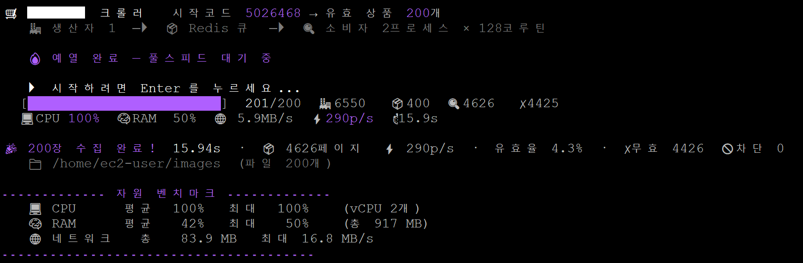</p>

멀티프로세스 버전 실행 (`main_mp.py`, 비교용):

<p align="center">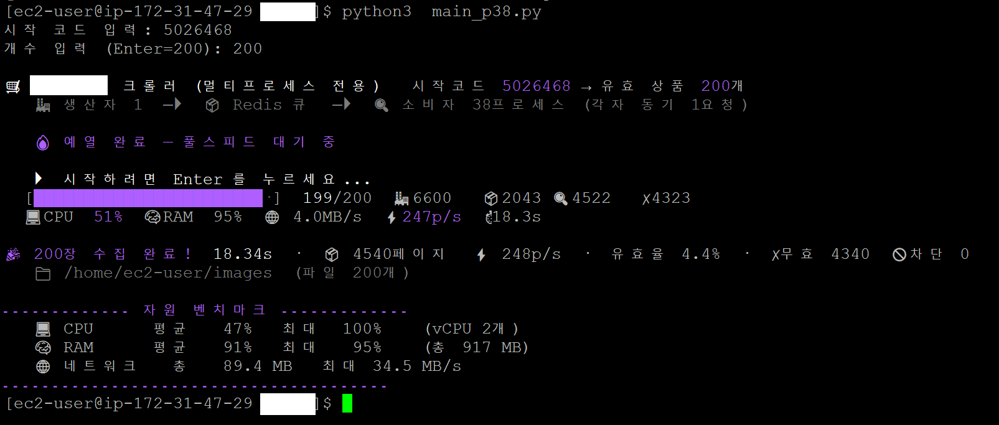</p>

> 측정 정확도를 위해 **프로세스 spawn·이벤트 루프·TLS 커넥션 예열을 타이머 밖**으로 빼고 'GO' 신호 뒤부터 시간을 쟀습니다. 소요 시간은 시드 유효율에 따라 달라집니다(위 시드는 유효율 ~4.3%).

### 예열(warm-up) — 측정에서 cold-start 제외

벤치마크 기법(워밍업 후 측정)에서 착안해, 한 번만 드는 cold-start 비용(프로세스 fork · 커넥션 풀 생성 · DNS·TLS 핸드셰이크)이 측정값을 오염시키지 않도록 아래 3단계를 **타이머 시작(`t0`) 전에 모두** 끝냅니다.

<p align="center">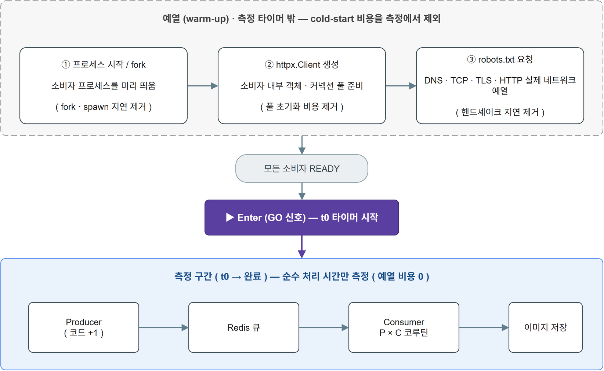</p>

1. **프로세스 시작 / fork** — 소비자 프로세스를 미리 띄움
2. **httpx.Client 생성** — 소비자 내부 객체·커넥션 풀 준비
3. **robots.txt 요청** — DNS·TCP·TLS·HTTP 실제 네트워크 예열

모든 소비자가 READY가 되면 `Enter`(GO 신호)를 누르는 순간 `t0` 타이머가 시작되고, 이후 **순수 처리 시간만** 측정됩니다. (draw.io 원본: [`diagrams/src/warmup-preloading.drawio`](diagrams/src/warmup-preloading.drawio))

## 7. 확장성 · 유지보수

요구사항 변경은 필연이라, 기존 시스템을 무너뜨리지 않고 새 기능을 끼워 넣을 수 있게 **모듈화**했습니다. 수집 대상(호스트·경로·이미지 필드)은 코드에 박지 않고 **환경변수로 주입**합니다.

<p align="center">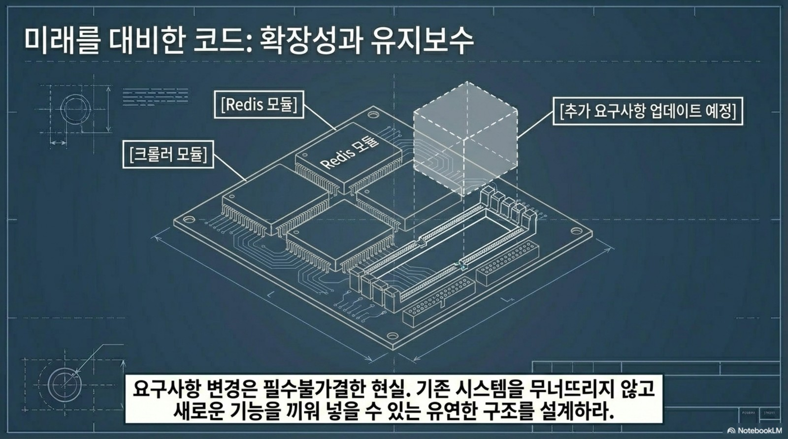</p>

## 8. 실행

```bash
pip install -r requirements.txt
# Redis 가 localhost:6379 에 떠 있어야 합니다.

export TARGET_HOST="<수집 대상 호스트>"   # 상품 상세가 https://HOST/goods/<코드> 형태라고 가정
export PROCESSES=2 CONCURRENCY=128         # 동시성 = 프로세스 × 코루틴
python3 main.py <START_CODE> <N>           # 인자 없이 실행하면 시작코드·개수를 입력받습니다

# (비교용) 멀티프로세스 전용 버전
PROCESSES=32 python3 main_mp.py <START_CODE> <N>
```

| 변수 | 기본값 | 설명 |
|---|---|---|
| `TARGET_HOST` | `www.example.com` | 수집 대상 호스트 |
| `TARGET_PAGE_PATH` | `/goods/{}` | 상품 상세 경로(`{}` = 상품코드) |
| `TARGET_IMAGE_FIELD` | `mainImageUrl` | 본문에서 이미지 URL을 담은 JSON 필드명 |
| `PROCESSES` | `2` (async) / `32` (mp) | 소비자 프로세스 수 |
| `CONCURRENCY` | `128` | 프로세스당 코루틴 수 (async) |
| `HTTP2` | `1` | `0`이면 HTTP/1.1 |

## 9. 디렉터리 구조

```
high-throughput-image-pipeline/
├── main.py            # ★ async(코루틴) 파이프라인 — 채택본
├── main_mp.py         #   멀티프로세스 전용 버전 (비교용)
├── requirements.txt   # httpx[http2] · redis · psutil
├── docs/              # 아키텍처 다이어그램(미션 브리프) · 실행/벤치 스크린샷
├── diagrams/          # 예열 흐름도 — draw.io 원본(src/) + PNG(png/)
└── README.md
```

---

<p align="center"><sub>아키텍처 다이어그램은 팀 미션 브리프(NotebookLM 제작) 슬라이드 발췌, 실행·벤치 스크린샷은 EC2 t3.micro 실측입니다.</sub></p>
